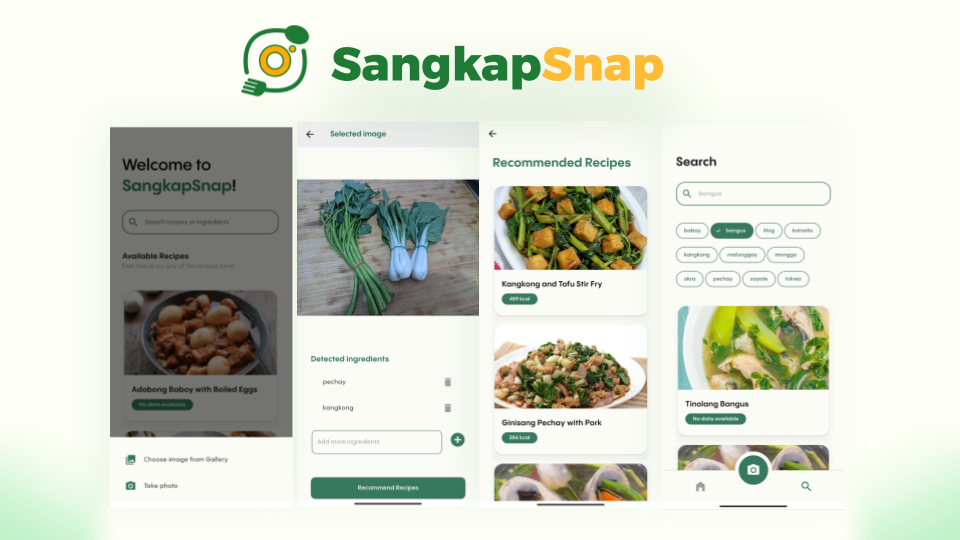

# 🥗📸 SangkapSnap

Cooking can be a challenge, especially when you’re busy and unsure of what to make with the ingredients that you have. SangkapSnap is a mobile application that uses AI to detect ingredients in your photo and recommend recipes based on what you have!

## Features 

* **Ingredient Detection:** Snap or upload a picture of your ingredients and the app will identify what those ingredients are
* **Recipe Recommendations:** The app will recommend recipes based on the detected ingredients
* **Recipe Search:** Find specific recipes quickly 

## Demo
https://github.com/user-attachments/assets/94522396-c0bc-4015-a4b4-138801535f10
